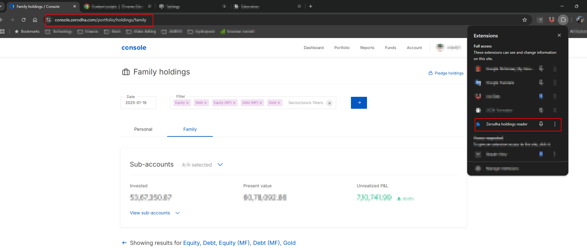
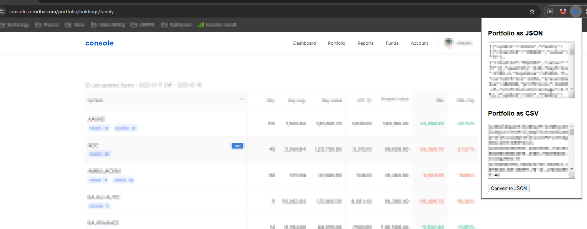
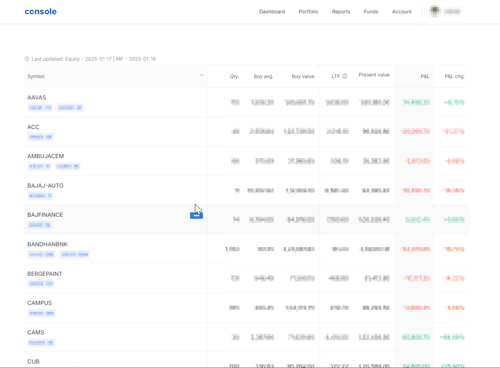

## Google Chrome Extension to download Zerodha holdings as JSON/CSV

### Installation
In order to run this extension, go to steps listed in screenshot.
- Enable developer mode
- Go to Load unpacked section
- Select folder path of this repository from local machine

This will install zerodha extension

### How to Run
- Click on the extensions section as shown in screenshot.
- Click on Zerodha holdings extension

#### How to use
Open your holdings page as shown in screenshot. This extension will work url `https://console.zerodha.com/portfolio/holdings*`. This means it would work with your personal portfolio as well as with family portfolio. Output of this extension will be in json as well as csv with delimiter as `#`

#### This is going to convert only the table data as shown in screenshot.
